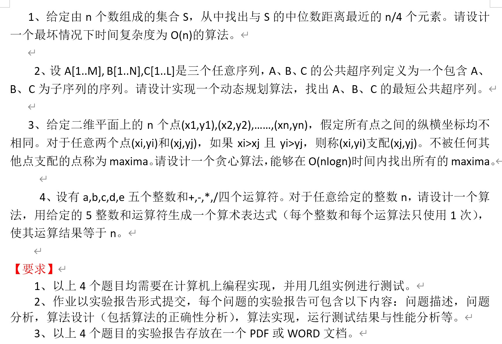

# 主页

## 板块

### 算法设计



- 1

```c++
#include<iostream>
#include<algorithm>
using namespace std;
double a[10086];
int n, index, lm, rm;
double b[10086];

int partition(double a[], int p, int r, int x,int xi){
	rm=lm=0;
	int i = p-1;
	int j = r+1;
	while(i<j){
		do i++;while(a[i]<=x&&i<r);
		do j--;while(a[j]>=x&&j>p);
		if(i < j)
			swap(a[i], a[j]);
	}
	swap(a[j],a[xi]);
	int ll=p-1, lr=j;
	while(ll<lr){
		do ll++;while(a[ll]!=x&&ll<j-1);
		do lr--;while(a[lr]==x&&lr>p);
		if(ll<lr)
			swap(a[ll], a[lr]),++lm;
	}
	int rl=j, rr=r+1;
	while(rl<rr){
		do rl++;while(a[rl]==x&&rl<r);
		do rr--;while(a[rr]!=x&&rr>j+1);
		if(rl<rr)
			swap(a[rl], a[rr]),++rm;
	}
	return j;
}

double select(double a[], int p, int r, int k){
	if(k==0) k=1;
	if(r - p < 7) {
		sort(a+p,a+r+1);
		index=p+k-1;
		return a[p+k-1];
	}
	
	for(int i = 0; i <= (r-p-4) / 5; i++){
		sort(a+p+i*5, a+p+i*5+5);
		swap(a[p+i], a[p+i*5+2]);
    }
	int x = (r-p-4)/5==0 ? a[p] : select(a, p, p+(r-p-4) / 5, (r-p-4) / 10);
	if((r-p-4)/5==0) index=p;
	int i = partition(a, p, r, x ,index);
	int j = i-p+1;
	if(k <= j){
		if(k >= j-lm){
			index=i;
			return a[i];
		}
		return select(a, p, i-lm-1, k);
	}
	else{
		if(k <= j+rm){
			index=i;
			return a[i];
		}
		return select(a, i+rm+1, r, k-j-rm);
	}
}

int main(){
    cin>>n;
	double mid;
    for(int i=0;i<n;i++) cin>>a[i];
	if(n%2==0) {
		mid = (select(a, 0, n-1, n/2+1)+select(a, 0, n-1, n/2))/2.0;
	}
	else mid = select(a, 0, n-1, n/2+1);
	for(int i=0;i<n;i++){
		b[i]=abs(a[i]-mid);
	}
	double MID = select(b, 0, n-1, n/4);
	int flag=0;
	for(int i=0;i<n;i++){
		if(flag>=n/4) break;
		if(abs(a[i]-mid)<=MID) flag++,cout<<a[i]<<" ";
	}
	return 0;
}
```

- 2

```c++
#include<string.h>
#include<iostream>
using namespace std;
int dp[105][105][105], DP[105][105];

char a[105], b[105], c[105], mid[211], ans[316];

int prog2(char a[], char b[], int ae, int be){
    char s[105], t[105];
    memset(s,0,sizeof(s));
    memset(t,0,sizeof(t));
    for(int i=0;i<=ae;i++) s[i]=a[i];
    for(int i=0;i<=be;i++) t[i]=b[i];
    int l_1=ae+1;
    int l_2=be+1;
    for(int i=0;i<=max(l_1,l_2);++i){
        DP[i][0]=DP[0][i]=i;
    }
    for(int i=1;i<=l_1;i++){
        for(int j=1;j<=l_2;j++){
            if(s[i-1]==t[j-1]) DP[i][j]=DP[i-1][j-1]+1;
            else DP[i][j]=min(DP[i][j-1], DP[i-1][j])+1;
        }
    }
    int now=0;
    char tmp[211];
    while(l_1&&l_2){
        if(DP[l_1][l_2]==DP[l_1-1][l_2-1]+1&&s[l_1-1]==t[l_2-1]){
            tmp[now++]=s[l_1-1];
            l_1--,l_2--;
        }
        else if(DP[l_1][l_2]==DP[l_1][l_2-1]+1&&s[l_1-1]!=t[l_2-1]){
            tmp[now++]=t[l_2-1];
            l_2--;
        }
        else if(DP[l_1][l_2]==DP[l_1-1][l_2]+1&&s[l_1-1]!=t[l_2-1]){
            tmp[now++]=s[l_1-1];
            l_1--;
        }
    }
    while(l_1) tmp[now++]=s[--l_1];
    while(l_2) tmp[now++]=t[--l_2];
    for(int i=0;i<now;i++) mid[i]=tmp[now-1-i];
    return now;
}

void prog(char a[], char b[], char c[]){
    int l=strlen(a), m=strlen(b), n=strlen(c);
    for(int i=0;i<=max(l,max(m,n));++i) 
        dp[0][0][i]=dp[0][i][0]=dp[i][0][0]=i;
    for(int i=1;i<=l;++i){
        for(int j=1;j<=m;++j){
            if(a[i-1]==b[j-1]) dp[i][j][0]=dp[i-1][j-1][0]+1;
            else dp[i][j][0]=min(dp[i-1][j][0],dp[i][j-1][0])+1;
        }
    }
    for(int j=1;j<=m;++j){
        for(int k=1;k<=n;++k){
            if(c[k-1]==b[j-1]) dp[0][j][k]=dp[0][j-1][k-1]+1;
            else dp[0][j][k]=min(dp[0][j-1][k],dp[0][j][k-1])+1;
        }
    }
    for(int i=1;i<=l;++i){
        for(int k=1;k<=n;++k){
            if(a[i-1]==c[k-1]) dp[i][0][k]=dp[i-1][0][k-1]+1;
            else dp[i][0][k]=min(dp[i-1][0][k],dp[i][0][k-1])+1;
        }
    }
    for(int i=1;i<=l;++i){
        for(int j=1;j<=m;++j){
            for(int k=1;k<=n;++k){
                if(a[i-1]==b[j-1]){
                    if(b[j-1]==c[k-1]) //a == b == c
                        dp[i][j][k]=dp[i-1][j-1][k-1]+1;
                    else  //a == b , c
                        dp[i][j][k]=min(dp[i-1][j-1][k], dp[i][j][k-1])+1;
                }
                else {
                    if(b[j-1]==c[k-1]) //b == c , a
                        dp[i][j][k]=min(dp[i-1][j][k], dp[i][j-1][k-1])+1;
                    else if(a[i-1]==c[k-1]) //a == c , b
                        dp[i][j][k]=min(dp[i][j-1][k], dp[i-1][j][k-1])+1;
                    else //a , b , c
                        dp[i][j][k]=min(dp[i][j][k-1], min(dp[i][j-1][k], dp[i-1][j][k]))+1;
                }
            }
        }
    }
    char tmp[316];
    int now=0;
    while(l&&m&&n){
        if(dp[l][m][n]==dp[l-1][m-1][n-1]+1&&a[l-1]==b[m-1]&&b[m-1]==c[n-1]){
            tmp[now++]=a[l-1];
            l--,m--,n--;
        }
        else if(dp[l][m][n]==dp[l-1][m][n]+1&&a[l-1]!=b[m-1]&&a[l-1]!=c[n-1]){
            tmp[now++]=a[l-1];
            l--;
        }
        else if(dp[l][m][n]==dp[l][m-1][n]+1&&a[l-1]!=b[m-1]&&b[m-1]!=c[n-1]){
            tmp[now++]=b[m-1];
            m--;
        }
        else if(dp[l][m][n]==dp[l][m][n-1]+1&&a[l-1]!=c[n-1]&&b[m-1]!=c[n-1]){
            tmp[now++]=c[n-1];
            n--;
        }
        else if(dp[l][m][n]==dp[l-1][m-1][n]+1&&a[l-1]==b[m-1]&&a[l-1]!=c[n-1]){
            tmp[now++]=a[l-1];
            l--,m--;
        }
        else if(dp[l][m][n]==dp[l-1][m][n-1]+1&&a[l-1]==c[n-1]&&a[l-1]!=b[m-1]){
            tmp[now++]=a[l-1];
            l--,n--;
        }
        else if(dp[l][m][n]==dp[l][m-1][n-1]+1&&b[m-1]==c[n-1]&&a[l-1]!=b[m-1]){
            tmp[now++]=b[m-1];
            m--,n--;
        }
    }
    int pre;
    if(!l) pre=prog2(b,c,m-1,n-1);
    else if(!m) pre=prog2(a,c,l-1,n-1);
    else pre=prog2(a,b,l-1,m-1);
    while(pre){
        tmp[now++]=mid[--pre];
    }
    for(int i=0;i<now;i++){
        ans[i]=tmp[now-1-i];
    }
    ans[now]='\0';
}

int main(){
    cin>>a>>b>>c;
    prog(a,b,c);
    cout<<ans;
}
```

- 3

```c++
#include<iostream>
#include<algorithm>
using namespace std;
int n;
typedef struct ppooss{
    int x;
    int y;
}pos;
pos p[10086];
bool cmp(pos a,pos b){
    return a.y>b.y;
}
int main(){
    cin>>n;
    for(int i=0;i<n;++i) {
        cout<<"x"<<i+1<<", y"<<i+1<<": ";
        cin>>p[i].x>>p[i].y;
    }
    sort(p,p+n,cmp);
    int now_x=p[0].x;
    int cnt=1;
    cout<<"maxima: "<<endl;
    cout<<"x"<<cnt<<"y"<<cnt<<": "<<p[0].x<<", "<<p[0].y<<endl;
    for(int i=1;i<n;i++) 
        if(p[i].x>now_x){
            cout<<"x"<<++cnt<<"y"<<cnt<<": "<<p[i].x<<", "<<p[i].y<<endl;
            now_x=p[i].x;
        }
}
```

- 4

```c++
#include<bits/stdc++.h>
using namespace std;

int gcd(int a,int b){
    return b?gcd(b,a%b):a;
}

struct number{
    int a, b;
    number(int aa,int bb){
        int f=gcd(abs(aa), abs(bb));
        aa/=f,bb/=f;
        a=aa, b=bb;
        if(b<0) b=-b,a=-a;
    }
};

int num[5];
int target;
int brackets[3]={202,178,170};
int opt[4]={0,1,2,3}; //+, -, *, /
stack<number> NUM;
stack<int> OPT;

bool cunzai(int i){
    while(!NUM.empty()) NUM.pop();
    while(!OPT.empty()) OPT.pop();
    NUM.push({num[0],1});
    for(int i=0;i<4;i++){
        OPT.push(opt[i]);
    }
    int nu_i=1;
    int bracket=brackets[i];
    while(bracket){
        if(bracket & 1){
            number m(0,1),n(0,1);
            m=NUM.top();
            NUM.pop();
            n=NUM.top();
            NUM.pop();
            int option=OPT.top();
            OPT.pop();
            if(option==0) NUM.push({m.a*n.b+m.b*n.a, m.b*n.b});
            else if(option==1) NUM.push({m.a*n.b-n.a*m.b, m.b*n.b});
            else if(option==2) NUM.push({m.a*n.a, m.b*n.b});
            else {
                if(n.a==0) return false;
                NUM.push({m.a*n.b, m.b*n.a});
            }
        }
        else{
            NUM.push({num[nu_i++],1});
        }
        bracket>>=1;
    }
    if(NUM.top().a==target && NUM.top().b==1) return true;
    else return false;
}

void printit(int i){
    char opsign[7]="+-*/()";
    stack<string> ans;
    stack<int> myopt;
    ans.push(to_string(num[0]));
    int nu_i=1;
    for(int i=0;i<4;i++){
        myopt.push(opt[i]);
    }
    int bracket=brackets[i];
    while(bracket){
        if(bracket & 1){
            string a=ans.top();
            ans.pop();
            string b=ans.top();
            ans.pop();
            int optnow=myopt.top();
            myopt.pop();
            if(optnow==0) ans.push(opsign[4]+a+opsign[0]+b+opsign[5]);
            else if(optnow==1) ans.push(opsign[4]+a+opsign[1]+b+opsign[5]);
            else if(optnow==2) ans.push(opsign[4]+a+opsign[2]+b+opsign[5]);
            else ans.push(opsign[4]+a+opsign[3]+b+opsign[5]);
        }
        else {
            ans.push(to_string(num[nu_i++]));
        }
        bracket>>=1; 
    }
    cout<<ans.top().substr(1,ans.top().length()-2)<<endl;
}

int main(){
    for(int i=0;i<5;i++) cin>>num[i];
    sort(num, num+5);
    cin>>target;
    int flag=0;
    do{
        do{
            for(int i=0;i<3;i++){
                if(cunzai(i)){
                    printit(i);
                    flag=1;
                }
            }
        }while(next_permutation(opt,opt+4));
    }while(next_permutation(num,num+5));
    if(!flag) cout<<"no way"<<endl;
}

```

### 数据结构

## 联系我

Email:[wendge@outlook.com](mailto:wendge@outlook.com)
